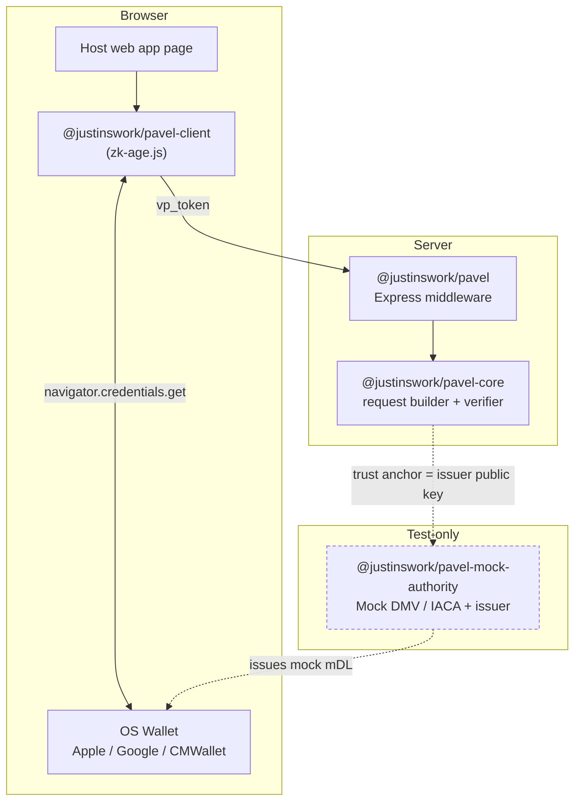
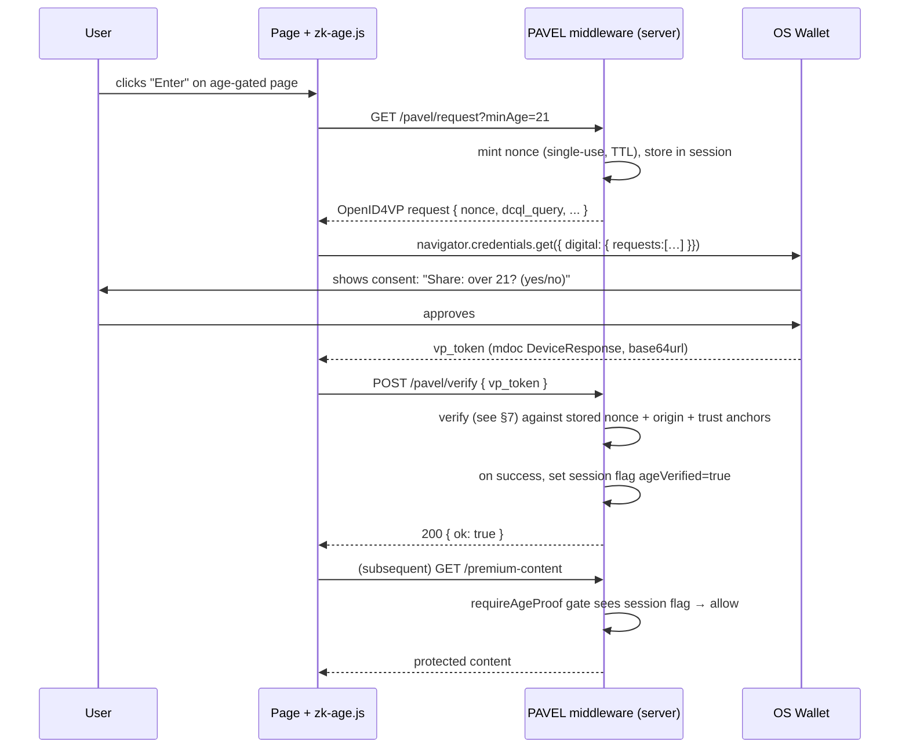
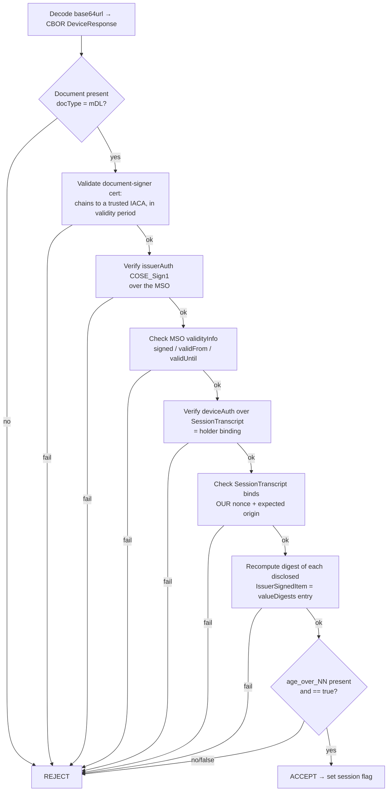
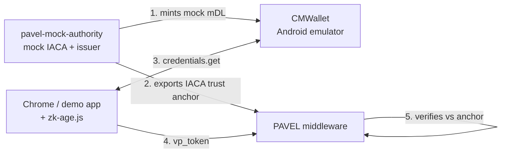

# PAVEL — Architecture & Design

> **Status:** design draft, pre-implementation. This document is the source of truth for how PAVEL is intended to work. It will evolve as the build proceeds; treat mismatches between this doc and the code as bugs in one or the other.

**PAVEL** (Privacy-first Age Verification & Eligibility Library) is a drop-in web gateway that lets a developer gate a route behind a *predicate* about the user ("is over 21") without the server ever receiving the user's personal data. It wraps the browser [W3C Digital Credentials API](https://www.w3.org/TR/digital-credentials/) and [ISO/IEC 18013-5 / -7 mdoc](https://www.iso.org/standard/69084.html) verification behind a two-line integration.

---

## Table of Contents

1. [Goals & Non-Goals](#1-goals--non-goals)
2. [Background Primer](#2-background-primer)
3. [System Components](#3-system-components)
4. [End-to-End Flow](#4-end-to-end-flow)
5. [The Request (OpenID4VP + DCQL)](#5-the-request-openid4vp--dcql)
6. [The Response (mdoc DeviceResponse)](#6-the-response-mdoc-deviceresponse)
7. [The Verification Pipeline](#7-the-verification-pipeline)
8. [Public API Design](#8-public-api-design)
9. [Trust Model & Configuration](#9-trust-model--configuration)
10. [Security & Privacy](#10-security--privacy)
11. [Technology Choices](#11-technology-choices)
12. [Repository Layout](#12-repository-layout)
13. [Testing Architecture](#13-testing-architecture)
14. [Open Questions & Risks](#14-open-questions--risks)
15. [References](#15-references)

---

## 1. Goals & Non-Goals

### Goals

- **Ergonomic integration.** A developer adds age-gating in ~2 lines of server code and ~1 SDK call in the browser. This developer-experience surface *is* the thesis contribution.
- **Data minimization by construction.** The default request asks for a single boolean predicate (`age_over_NN`). It is not *possible* through the ergonomic API to accidentally request name, DOB, or address.
- **Offline testability.** The whole system runs and is demonstrable on one machine with no external accounts, using a self-issued trust root (see [§13](#13-testing-architecture)).
- **Standards-first.** Build on the mechanisms that ship in stable browsers today (OpenID4VP over the DC API, ISO 18013-7 mdoc), not bespoke crypto.

### Non-Goals

- **Not** a wallet or issuer. PAVEL is purely the *verifier / relying-party* side.
- **Not** a production relying-party onboarding tool. Registration with Google/Apple (production CSR, review) is out of scope; PAVEL targets the sandbox + mock-authority path.
- **Not** full zero-knowledge unlinkability in v1. Longfellow-ZK integration is a fenced stretch objective (see [§10.4](#104-known-limitation-linkability)).
- **Not** an identity/session framework. PAVEL grants a verified eligibility fact; the host app owns its own login/session semantics (PAVEL integrates with them).

---

## 2. Background Primer

Four moving parts, from the phone to the server:

| Layer | What it is |
|---|---|
| **Digital Credentials API (DC API)** | Browser API — `navigator.credentials.get({ digital: … })` — that lets a web page request a credential presentation from the OS wallet. Shipped in stable Chrome and Safari. |
| **OpenID4VP** | The *protocol* carried over the DC API. Defines the Authorization Request (what the verifier asks for) and the `vp_token` response. |
| **DCQL** | *Digital Credentials Query Language* — the JSON query, inside the OpenID4VP request, that declares which credential and which claims are wanted. |
| **mdoc (ISO 18013-5/-7)** | The CBOR credential *format* the wallet returns — a `DeviceResponse` containing issuer-signed data plus a device-signed proof of holder binding. An mDL (mobile driver's license) is an mdoc with `docType = org.iso.18013.5.1.mDL`. |

**Selective disclosure** is the property that makes this private: the issuer signs a set of *salted hashes* of every attribute (in the MSO), but the wallet only reveals the specific attributes the verifier asked for. Requesting `age_over_21` returns one signed boolean; birthdate never leaves the device. See [§6](#6-the-response-mdoc-deviceresponse) for the mechanism.

Terms are defined in [GLOSSARY.md](GLOSSARY.md).

---

## 3. System Components

PAVEL is a small monorepo of focused packages plus a demo app and a test-only authority.



| Package | Runtime | Responsibility |
|---|---|---|
| `@justinswork/pavel-core` | Node (isomorphic where possible) | Pure logic: build the OpenID4VP/DCQL request, parse & verify the mdoc `DeviceResponse`, extract the predicate result. No Express/DOM coupling. |
| `@justinswork/pavel` | Node / Express | The `requireAgeProof()` middleware + the request/verify HTTP endpoints. Thin adapter over `-core`. |
| `@justinswork/pavel-client` (`zk-age.js`) | Browser | Fetches the request from the server, calls `navigator.credentials.get()`, posts the response back. |
| `@justinswork/pavel-mock-authority` | Node (library + CLI) | **Test only, publishable.** Generates an IACA root + document-signer key, issues mock mDLs, and exports the trust anchor. Consumers import it to test their own PAVEL integration offline — no real wallet or DMV. |
| `@justinswork/pavel-demo` | Node + browser | Reference age-gated e-commerce app wiring all of the above together. |

**Why the `-core` split:** the verification logic is the hard, security-sensitive part and the most reusable. Keeping it framework-agnostic means it can later back a Fastify/Koa/Next adapter, or run in an edge runtime, without change.

---

## 4. End-to-End Flow

The critical design decision: **the nonce is minted server-side, bound to the session, single-use, and short-lived.** The browser never invents the challenge. This is what makes the presentation fresh and un-replayable.



Note the two roles the middleware plays: (1) the **request/verify endpoints** that run the ceremony, and (2) the **`requireAgeProof` gate** that simply checks the resulting session flag on later requests. They are decoupled so the ceremony can happen once and gate many routes. (A gate can opt out of this caching with `forceReverify` to demand a fresh proof per action — see [§8](#8-public-api-design).)

---

## 5. The Request (OpenID4VP + DCQL)

The server builds an OpenID4VP Authorization Request tailored for the DC API. A minimal age request:

```jsonc
{
  "response_type": "vp_token",
  "response_mode": "dc_api",            // "dc_api.jwt" for an encrypted response (recommended in prod)
  "nonce": "9c1f…server-minted…",       // single-use, bound to the session
  "dcql_query": {
    "credentials": [
      {
        "id": "age_check",
        "format": "mso_mdoc",
        "meta": { "doctype_value": "org.iso.18013.5.1.mDL" },
        "claims": [
          { "path": ["org.iso.18013.5.1", "age_over_21"] }
        ]
      }
    ]
  },
  "client_metadata": { /* verifier display name, response-encryption key, … */ }
}
```

The SDK wraps this in the DC API envelope:

```js
const res = await navigator.credentials.get({
  digital: { requests: [{ protocol: "openid4vp", data: authorizationRequest }] }
});
// res.data → the OpenID4VP response containing vp_token
```

**Design notes / gotchas**

- **`age_over_NN` is a set, not a range.** ISO 18013-5 defines discrete boolean elements `age_over_18`, `age_over_21`, etc. The verifier must request the *specific* one it needs. If an issuer didn't include `age_over_21` in the credential, that predicate can't be satisfied — `-core` must surface this as a distinct "predicate unavailable" outcome rather than a generic failure. `minAge` maps to `age_over_<minAge>`.
- **Never fall back to `birth_date`.** Computing age from DOB would defeat the privacy goal. If the exact `age_over_NN` isn't available, PAVEL fails closed rather than requesting DOB.
- **Safari currently speaks `org-iso-mdoc`, Chrome speaks both `openid4vp` and `org-iso-mdoc`.** `pavel-client` should be able to emit either protocol string; `-core` normalizes both into the same DCQL-shaped intent. Track this as a compatibility matrix.
- **Response encryption (`dc_api.jwt`).** For production the response should be encrypted to a key in `client_metadata` so intermediaries can't read the disclosed attribute. For the dev harness, unencrypted `dc_api` is fine; the design keeps encryption behind a config flag.

---

## 6. The Response (mdoc DeviceResponse)

The `vp_token` value for `age_check` is a base64url-encoded CBOR `DeviceResponse`. Structure (abridged):

```
DeviceResponse
└─ documents[ ]
   └─ document (docType = org.iso.18013.5.1.mDL)
      ├─ issuerSigned
      │  ├─ nameSpaces
      │  │  └─ "org.iso.18013.5.1"
      │  │     └─ [ IssuerSignedItem, … ]      ← only the DISCLOSED items
      │  │        └─ { digestID, random, elementIdentifier, elementValue }
      │  └─ issuerAuth                          ← COSE_Sign1 over the MSO
      │     └─ x5chain header = document-signer cert (chains to IACA)
      └─ deviceSigned
         └─ deviceAuth                          ← COSE_Sign1 / MAC over SessionTranscript
```

**How selective disclosure works.** The **MSO** (Mobile Security Object), signed by the issuer via `issuerAuth`, contains a `valueDigests` map: for every attribute in the credential, a salted SHA-256 hash indexed by `digestID`. Crucially, the MSO commits to *all* attributes' hashes, but the wallet only ships the `IssuerSignedItem`s for the attributes the user disclosed. To verify a disclosed item, the verifier recomputes `SHA-256(IssuerSignedItem)` and checks it equals `valueDigests[namespace][digestID]`. Undisclosed attributes are present only as opaque hashes — birthdate is provably not in the payload.

Key MSO fields the verifier uses: `version`, `digestAlgorithm` (SHA-256), `docType`, `valueDigests`, `deviceKeyInfo` (the device public key for holder binding), and `validityInfo` (signed/valid-from/valid-until).

---

## 7. The Verification Pipeline

`@justinswork/pavel-core` runs these checks in order and **fails closed** on any failure. This ordering is derived from ISO 18013-5 §9 and the OpenID4VP DC API rules.



Each numbered concern:

1. **Structural** — decodes; contains a document of the expected `docType`.
2. **Issuer trust chain** — the document-signer certificate in the `issuerAuth` header chains to a configured trusted **IACA** root and is within its validity window.
3. **Issuer signature** — the `issuerAuth` `COSE_Sign1` over the MSO verifies under the document-signer key. *(Credential is authentic and untampered.)*
4. **Credential validity window** — `validityInfo` shows the credential is currently valid (not expired / not yet valid).
5. **Holder binding** — `deviceAuth` verifies under the `deviceKey` from the MSO. *(The presenter controls the device the credential was bound to — not a copied credential.)*
6. **Freshness & audience binding** — the `SessionTranscript` that `deviceAuth` signs over incorporates **our** single-use nonce and the **expected web origin**. This defeats replay and cross-site relay/phishing. The nonce is then consumed.
7. **Digest integrity** — each disclosed `IssuerSignedItem`'s recomputed salted hash matches the MSO `valueDigests`. *(The disclosed attributes are exactly what the issuer signed.)*
8. **Predicate** — the requested `age_over_NN` element is present and `true`.

Only if all pass does PAVEL record the eligibility fact. The result object distinguishes outcomes: `verified` | `predicate_false` | `predicate_unavailable` | `untrusted_issuer` | `expired` | `replay` | `malformed`.

**Implementation note (post-spike).** `-core` realizes this pipeline by wrapping `@auth0/mdl`'s `Verifier`, whose assessments map onto steps 2–7. Two wrinkles the spike surfaced: (a) `@auth0/mdl` collapses **holder binding (5)** and **freshness/audience (6)** into a single `deviceAuth` verdict over the `SessionTranscript`, so to keep surfacing `replay` distinctly `-core` pre-checks the transcript it supplies; and (b) there is no library helper for the DC API `SessionTranscript`, so `-core` builds it — `[null, null, ["OpenID4VPDCAPIHandover", SHA-256(cbor([origin, nonce, null]))]]` — and passes it to the verifier.

---

## 8. Public API Design

### Server (Express)

```js
import { pavel, requireAgeProof } from "@justinswork/pavel";

// 1. Mount the ceremony endpoints (GET /pavel/request, POST /pavel/verify)
app.use(pavel({
  trustAnchors: [ /* IACA cert(s); mock in dev, DMV in prod */ ],
  origin: "https://shop.example",          // expected origin, bound into the request
  session: "express-session",               // where to record the verified flag
}));

// 2. Gate any route
app.post("/premium-content", requireAgeProof({ minAge: 21 }), (req, res) => {
  res.send("Access granted — age verified, no personal data received.");
});

// 3. Or require a fresh proof for *every* gated action (see "Verification lifetime")
app.post("/checkout", requireAgeProof({ minAge: 21, forceReverify: true }), placeOrder);
```

`requireAgeProof({ minAge })` checks the session flag; if absent it responds `401` with a machine-readable hint (`{ error: "age_verification_required", requestUrl: "/pavel/request?minAge=21" }`) that the SDK uses to kick off the ceremony. This keeps gating declarative and the ceremony lazy.

**Verification lifetime.** By default a successful ceremony sets a session flag that satisfies later gates for the life of the session (*ceremony once → gate many*, [§4](#4-end-to-end-flow)). Some relying parties must instead re-verify on **every** gated action, regardless of a recent prior verification (per-transaction compliance postures). `forceReverify: true` makes the proof **one-shot**: it authorizes exactly the action it gates and is consumed once that action completes successfully, so the next gated request re-runs the ceremony. Default is `false`. A bounded-freshness middle ground — accept a proof issued within the last *N* minutes rather than all-or-nothing — is a planned `maxAge` option ([§14](#14-open-questions--risks)).

### Browser (`zk-age.js`)

```js
import { requestAgeProof } from "@justinswork/pavel-client";

const result = await requestAgeProof({ minAge: 21 });
// result: { ok: true } | { ok: false, reason: "declined" | "unsupported" | "predicate_false" }
if (result.ok) location.reload();
```

`requestAgeProof` handles the whole dance: `GET /pavel/request`, `navigator.credentials.get()`, `POST /pavel/verify`. It also feature-detects the DC API and returns `unsupported` gracefully so callers can present a fallback.

**Design principle:** the *only* knob a typical developer touches is `minAge`. Namespaces, doctypes, DCQL, CBOR, and COSE are all internal. Escaping to a lower level (custom claims, other credential types) is possible via `pavel-core` but deliberately not the front-door API.

---

## 9. Trust Model & Configuration

PAVEL trusts a credential iff its document-signer certificate chains to a configured **IACA** trust anchor.

| Environment | Trust anchor | Source |
|---|---|---|
| **Dev / test** | Mock IACA generated by `pavel-mock-authority` | Local — the same tool that issues the mock mDL loaded into the emulated wallet. |
| **Production** | Real issuing-authority roots (e.g. state DMV / AAMVA DTS, or the Google/Apple-brokered trust list) | Configured explicitly by the integrator; PAVEL ships no implicit trust. |

Configuration is explicit and code-reviewed — there is no "trust everything" default. Anchors are supplied as PEM/DER certs at middleware init. This is the single most security-critical piece of configuration and is documented as such.

---

## 10. Security & Privacy

### 10.1 Threat model (summary)

| Threat | Mitigation |
|---|---|
| **Replay** of a captured `vp_token` | Server-minted single-use nonce with short TTL, bound into the `SessionTranscript` and consumed on verify. |
| **Cross-site relay / phishing** (token obtained on attacker's site, replayed to ours, or vice-versa) | Expected **origin** bound into the request/handover and checked in step 6. |
| **Forged / tampered credential** | Issuer `COSE_Sign1` over the MSO + digest-match of every disclosed item (steps 3, 7). |
| **Copied credential** (exfiltrated from another device) | Device holder binding via `deviceAuth` (step 5). |
| **Expired / revoked credential** | `validityInfo` window (step 4); revocation handling noted as an open question (§14). |
| **Untrusted issuer** | IACA chain check (step 2); no implicit trust (§9). |
| **Response eavesdropping** | TLS; optional `dc_api.jwt` response encryption to the verifier's key. |
| **Over-collection by the developer** | Ergonomic API can only request a boolean predicate; no DOB path. |
| **Session fixation** after verify | Rotate/regenerate session on successful verification. |

### 10.2 Privacy properties delivered

- The server receives **one signed boolean** (`age_over_NN = true`) and nothing else — no name, DOB, address, photo, or document number.
- The user sees an explicit OS-level consent prompt naming exactly what is shared.

### 10.3 Data handling

PAVEL does not persist the credential or any disclosed attribute. The only durable artifact is a boolean session flag ("this session is age-verified") plus, optionally, an audit log entry that records *the outcome and timestamp*, never the credential contents.

### 10.4 Known limitation: linkability

Plain mdoc selective disclosure reveals the **issuer's signature** (the document-signer cert and `issuerAuth`). In principle a verifier — or colluding verifiers — could correlate presentations by that signature, and the verifier learns *which* authority issued the credential. This is a second-order privacy gap, not a PII leak. Closing it fully requires a zero-knowledge proof that hides the signature itself, which is the **Longfellow-ZK stretch objective**: swap the "verify `COSE_Sign1`" step for "verify a ZK range proof" while the rest of the pipeline is unchanged. The architecture isolates this behind the `-core` verifier interface so it can be added without touching the SDK or middleware.

---

## 11. Technology Choices

| Concern | Choice | Rationale |
|---|---|---|
| Language | **TypeScript** | Types are part of the DX thesis; the middleware/SDK contract is much clearer with them, and the domain (CBOR maps, COSE structures) is error-prone untyped. |
| mdoc verification | **`@auth0/mdl` v3.0.1** — confirmed by spike (§14 #1); `@animo-id/mdoc` / `mdoc-ts` remain fallbacks | Wraps all the COSE/CBOR/PKI: issuing (`Document.sign`) and a `Verifier` that runs the full check set — IACA chain, issuer signature, MSO validity, deviceAuth holder binding, digest match — plus selective disclosure with built-in `age_over_NN` handling. `-core` wraps it rather than hand-rolling COSE. |
| CBOR / COSE | Provided transitively by the mdoc lib (e.g. `cbor-x`, COSE helpers) | Avoid a second, divergent CBOR stack. |
| Server | **Express** first, adapter pattern for others | Matches the proposal; `-core` stays framework-free. |
| Sessions | Pluggable (`express-session` in the demo) | PAVEL records a flag; it does not own session storage. |
| Build / mono-repo | pnpm workspaces + tsup/tsc | Lightweight; good for publishing several small packages. |
| Tests | Vitest (unit) + a scripted emulator flow (integration) | See §13. |

> ✅ **Resolved by spike (2026-08-03).** `@auth0/mdl` does the crypto and accepts an arbitrary session transcript, so `-core` wraps it. It has *no* DC API *handover* helper (only the `response_uri` OID4VP and WebAPI variants), so `-core` constructs the DC API `SessionTranscript` itself and hands the bytes to the verifier (and, in tests, the presenter). The spike minted an mDL, presented a `DeviceResponse` bound to a hand-built DC API transcript, and verified it end-to-end — every check passing, only `age_over_21` disclosed, and a wrong-origin transcript correctly rejected. The residual risk is now narrow: the exact handover byte layout for *real-wallet* interop, pinned in the integration tier (§14 #1).

---

## 12. Repository Layout

```
pavel/
├─ README.md
├─ LICENSE                      # Apache-2.0
├─ docs/
│  ├─ ARCHITECTURE.md           # this file
│  └─ GLOSSARY.md
├─ packages/
│  ├─ core/                     # @justinswork/pavel-core
│  ├─ middleware/               # @justinswork/pavel  (Express)
│  ├─ client/                   # @justinswork/pavel-client (zk-age.js)
│  └─ mock_authority/           # @justinswork/pavel-mock-authority (test-only)
├─ apps/
│  └─ demo/                     # @justinswork/pavel-demo (reference e-commerce app)
└─ examples/                    # minimal copy-paste integration snippets
```

---

## 13. Testing Architecture

Design goal: **the entire system is verifiable offline, on one machine, with no external accounts.**



Three tiers:

1. **Unit** (`-core`) — golden-vector tests: pre-generated `DeviceResponse` fixtures (valid, tampered, expired, wrong-origin, predicate-false, wrong-issuer) asserting each pipeline outcome. Fast, deterministic, no emulator. This is where most correctness confidence comes from.
2. **Integration** — `pavel-mock-authority` mints a mock mDL; the [CMWallet](https://digitalcredentials.dev/docs/samples/android-wallet-sample/) sample app in an Android emulator holds it; a scripted browser drives the demo app through the real `navigator.credentials.get()` ceremony.
3. **Sandbox parity** — where feasible, run the verifier against Google's published Sandbox Mode test keys/metadata to confirm behavior matches production-shaped data.

Registration as an approved relying party (production CSR, review) is required only for *real* consumer wallets and is out of scope. The delivered code is production-applicable once that step is completed.

---

## 14. Open Questions & Risks

| # | Item | Why it matters | Plan |
|---|---|---|---|
| 1 | **RESOLVED (spike).** Whether `@auth0/mdl` handles the **DC API session-transcript/handover** for ISO 18013-7, not just 18013-5. | Determined whether `-core` wraps a library or hand-rolls COSE. | ✅ **Wrap `@auth0/mdl`.** `-core` owns the DC API `SessionTranscript`: `[null, null, ["OpenID4VPDCAPIHandover", SHA-256(cbor([origin, nonce, null]))]]`. **Residual:** pin the exact handover bytes against a real wallet (CMWallet) in the integration tier. |
| 2 | **Revocation.** mdoc supports status mechanisms but they're inconsistently deployed. | A valid-signature credential could still be revoked. | v1 checks `validityInfo`; treat status-list revocation as a documented gap / stretch. |
| 3 | **Protocol drift** — `openid4vp` vs `org-iso-mdoc`, response-mode encryption, DCQL revisions. | Chrome and Safari differ today; specs still moving. | Maintain a compatibility matrix; normalize both protocol strings in `-core`. |
| 4 | **`age_over_NN` availability** varies by issuer. | Requested predicate may not exist in a given credential. | Distinct `predicate_unavailable` outcome; never fall back to DOB. |
| 5 | **Longfellow-ZK maturity** (C++, in security review, WASM binding cost). | Stretch objective feasibility. | Isolated behind the `-core` verifier interface; core deliverables don't depend on it. |
| 6 | **Verification lifetime / freshness** — how long a proof gates for: per-session vs. per-action. | Some relying parties must re-verify at every transaction; others cache for the session. Neither should be hard-coded. | Default verify-once-per-session; `forceReverify` opt-in for one-shot per-action gating ([§8](#8-public-api-design)). Bounded-freshness `maxAge` window is a planned middle ground. |

---

## 15. References

- [W3C Digital Credentials API](https://www.w3.org/TR/digital-credentials/)
- [OpenID for Verifiable Presentations 1.0](https://openid.net/specs/openid-4-verifiable-presentations-1_0.html) (incl. DC API + DCQL)
- ISO/IEC 18013-5 (mDL data model) and 18013-7 (online presentation)
- [Chrome for Developers — Digital Credentials API](https://developer.chrome.com/blog/digital-credentials-api-shipped)
- [WebKit — Online Identity Verification with the Digital Credentials API](https://webkit.org/blog/17431/online-identity-verification-with-the-digital-credentials-api/)
- [`@auth0/mdl`](https://www.npmjs.com/package/@auth0/mdl) · [`@animo-id/mdoc`](https://github.com/animo/mdoc) · [OpenWallet Foundation `mdoc-ts`](https://github.com/openwallet-foundation-labs/mdoc-ts)
- [CMWallet sample (test wallet)](https://digitalcredentials.dev/docs/samples/android-wallet-sample/)
- [Google Longfellow-ZK](https://github.com/google/longfellow-zk)
